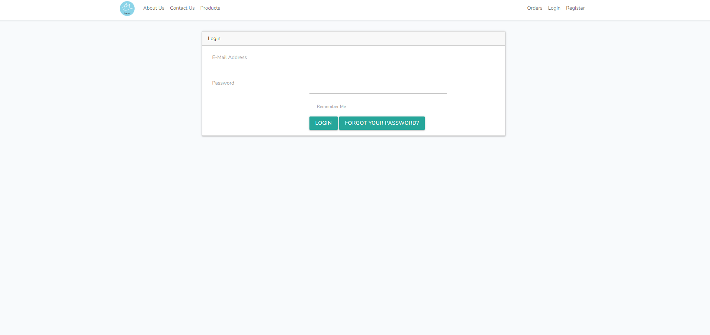
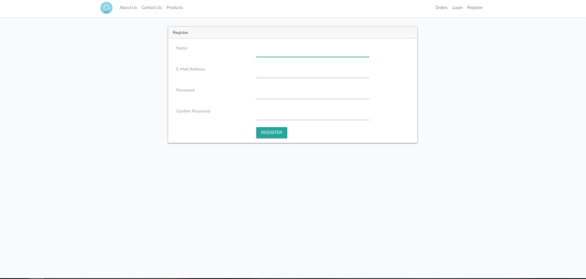
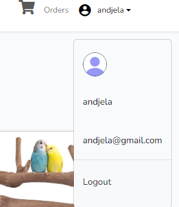
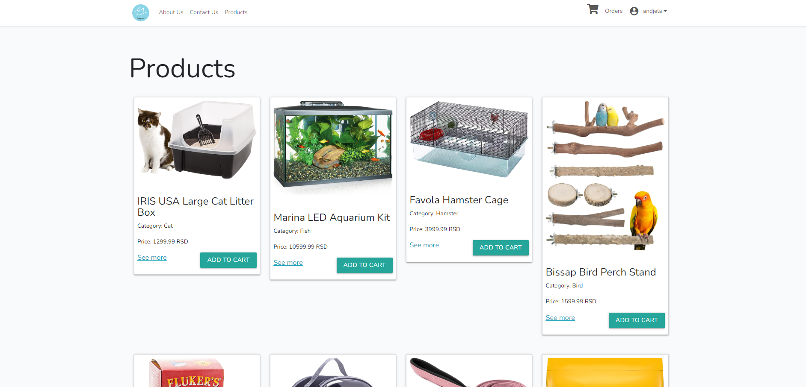
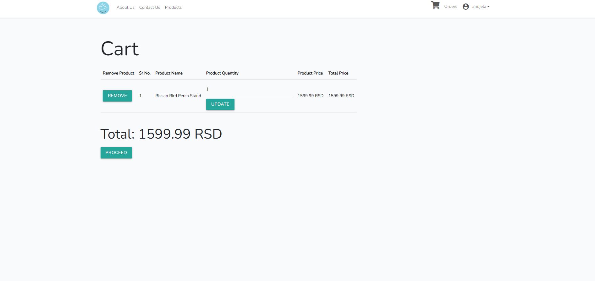
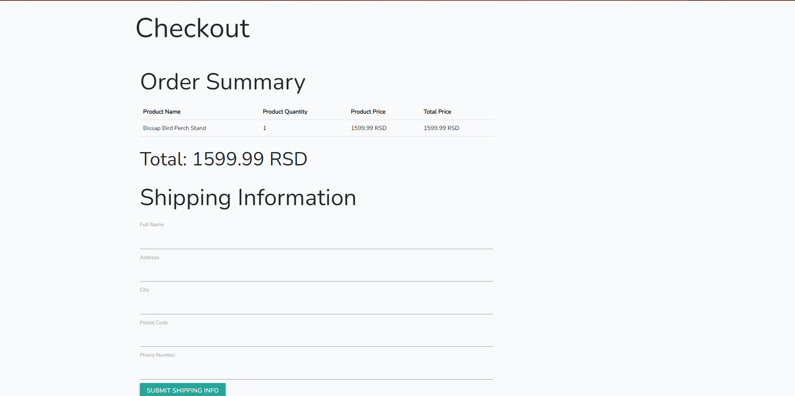

# petShop projekat
Ovaj projekat predstavlja dinamičku web prodavnicu za hranu i opremu za kućne ljubimce pod nazivom Happy Pets. Izrađen je kao seminarski, a kasnije i diplomski rad na fakultetu.

## Funkcionalnosti

### Za sve korisnike
- Pregled stranica: *Login*, *Reset Password* i *Register*
- Registracija naloga
- Ulogovanje

### Za kupce
- Pregled stranica: *Home*, *About Us*, *Contact Us*, *Products*, *Cart*, *Checkout*, *Orders*
- Pregled detalja svakog proizvoda
- Dodavanje proizvoda u korpu
- Prikaz informacija o narudžbini

### Za admine
- Admin *Home* stranica sa listom svih proizvoda i opcijama za imenu i brisanje
- Dodatne stranice *Add New Product* za dodavanje novog proizvoda i *Edit Product* za izmenu postojećeg
- Dodatne opcije za izmene informacija o proizvodima

## Korišćene tehnologije i alati

- PHP uz Laravel Framework
- Composer
- Artisan CLI
- Visual Studio Code okruženje
- XAMPP (Apache + MySQL)

# Korisničko uputstvo

### Potrebno za pokretanje

- Instalirati **XAMPP** uz Apache i MySQL
- Instalirati **PHP**
- Instalirati **Composer**
- Pokrenuti MySQL Server

### Instalacija

1. Kloniranti ovaj repozitorijum

  `git clone https://github.com/andjela-robal/petShop-diplomski`

2. Instalirati zavisnosti

  `composer install`

3. Napraviti fajl `.env`

  `cp .env.example .env`

4. Kreirati bazu podataka pod nazivom `petshopdb`

5. U `.env` fajlu promeniti podatke za bazu po potrebi

  ```
  DB_DATABASE=petshopdb
  DB_USERNAME=root
  DB_PASSWORD:
  ```

6. Generisati aplikacioni ključ (APP KEY)

  `php artisan key:generate`

7. Pokrenuti migracije

  `php artisan migrate`

8. Popuniti tabele u bazi podataka

  `php artisan db:seed`

9. Pokrenuti server

  `php artisan serve`
  
### Nalozi za testiranje
#### Admin nalog
- Email: `andjela@gmail.com`
- Password: `12345678`

#### Nalog kupca
- Email: `test@gmail.com`
- Password: `87654321`

## Napomena

Slike i informacije o proizvodima korišćene u ovom projektu preuzete su sa interneta i služe **isključivo za demonstraciju korisničkog interfejsa**. Projekat se ne koristi u komercijalne svrhe.

# Slike sajta



<p align="center">
  
</p>






